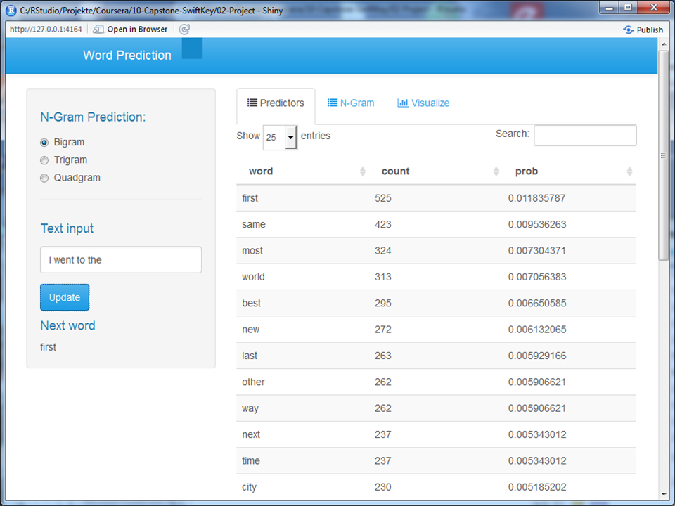

A Shiny App for Word Prediction
========================================================
author: Florian Ulmar  
date: 27.04.2016

The Problem
========================================================

Around the world, people are spending an increasing amount of time on their mobile devices for email, social networking, banking and a whole range of other activities. But typing on mobile devices can be a serious pain.

Text prediction is something that can make our lives easier. The goal of this Capstone Project was to develope a data product that takes as input a phrase (multiple words), one clicks submit, and it predicts the next word.

The Dataset
========================================================

We explored three datasets in English language which can be downloaded from  [Coursera-SwiftKey.zip](
"https://d396qusza40orc.cloudfront.net/dsscapstone/dataset/Coursera-SwiftKey.zip")

|File              |Size   |   Lines| maxChar|
|:-----------------|:------|-------:|-------:|
|en_US.blogs.txt   |200 MB |  899288|   40833|
|en_US.twitter.txt |196 MB | 1010242|   11384|
|en_US.news.txt    |159 MB | 2360148|     140|

The following steps were necessary to get a cleansed dataset

* taking a sample of 3 x 10000 lines

* remove punctuation, numbers, whitespaces, badwords, ...

* building frequency tables of words and word groups

The Algorithm
========================================================

The probability for the next word can be estimated by the previous word or a couple of previous words and not by the entire context (Markow assumption)

$$ P(w_i | w_1 w_2 \dots w_{i-1}) \approx P(w_1 | w_{i-k} \dots w_{i-1} w_i) $$

Example: The probability of a word estimated by one previsous word is given by

$$ P(w_n | w_{n-1})=\frac{\text{count}(w_{n-1}w_n)}{\text{count}(w_{n-1})} $$

Predict the next word by looking in the frequence table and take the word group, called n-gram, with the highest probability

The Solution
========================================================

Using the App is very simple: Just choose the algorithm, type some text and press the submit button...

The App can be found under [https://ulmarf.shinyapps.io/Text-Prediction/]
